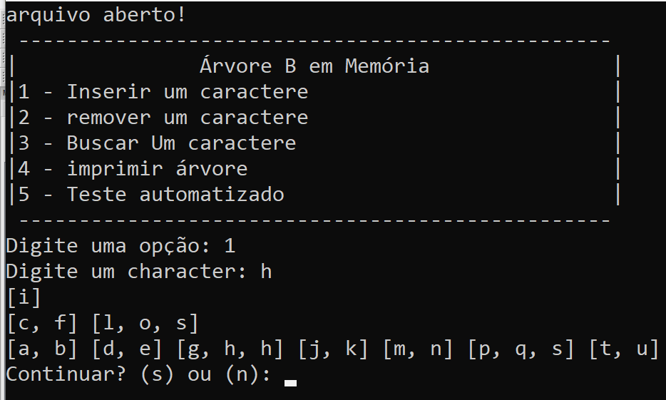
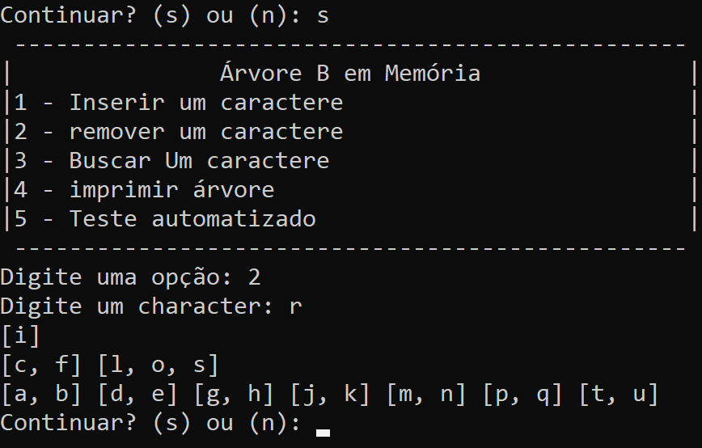
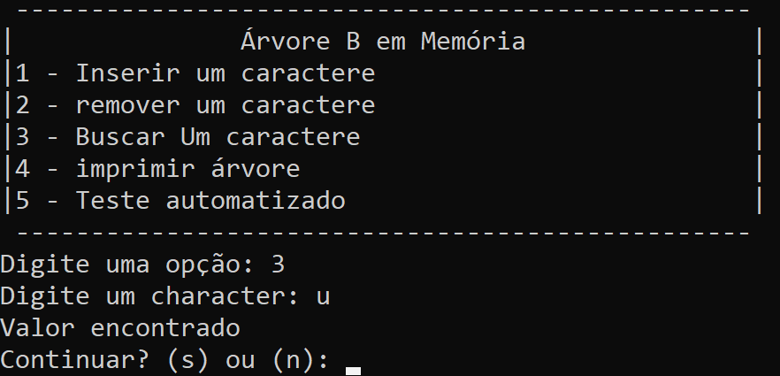
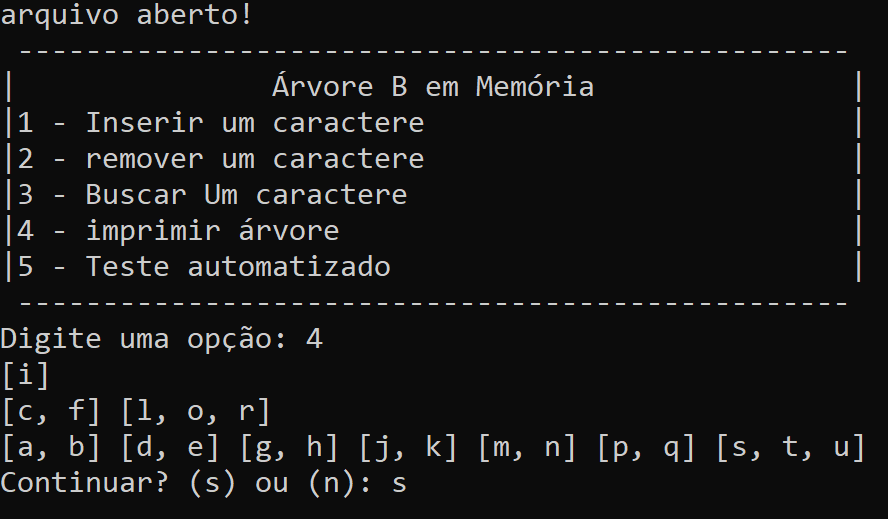

# DiskBtree
# ℹ Sobre
Disk Btree implementation based on the definition of cormen degree

### Features
<ul>
	<li>Insertion</li>
	<li>Deletion (no backtracking)</li>
  <li>Search</li>
  <li>Print Tree</li>
  <li>Automated testing</li>
  
</ul>

### Technologies Used
<ul>
	<li>C++</li>
</ul>

### ScreenShots
<ul>
	<li>
    <h3>Inserting<h3/>
     
    
     
  </li>
  <li>
    <h3>Removing<h3/>
     
    
     
  </li>
  <li>
    <h3>Search<h3/>
     
    
     
  </li>
  <li>
    <h3>Print Tree<h3/>
     
    
     
  </li>
</ul>
